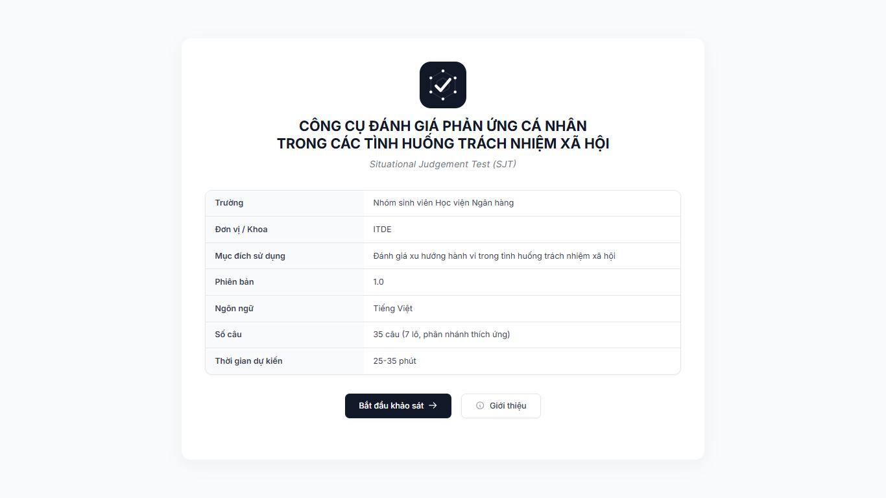
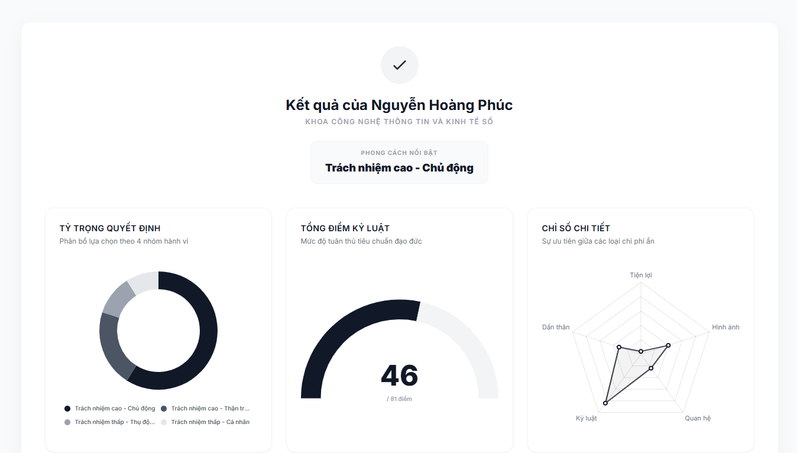
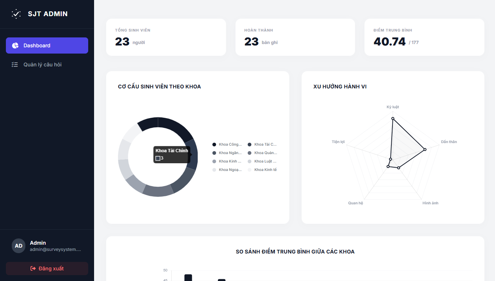

# Adaptive SJT Survey System

Hệ thống Khảo sát Trắc nghiệm Tình huống Thích ứng (Adaptive Situational Judgment Test) phân tích hành vi và xu hướng ra quyết định của đối tượng khảo sát.

---

## 1. Tổng quan dự án (Overview)

- **Vấn đề nghiên cứu:** Các bài khảo sát truyền thống thường được thiết kế tuyến tính, dẫn đến sự nhàm chán và không đánh giá chính xác phản xạ thực tế của người tham gia khi đối mặt với các tình huống phức tạp.
- **Giải pháp đề xuất:** Xây dựng hệ thống áp dụng phương pháp SJT kết hợp thuật toán rẽ nhánh thích ứng (Adaptive Branching). Căn cứ vào điểm số của các lựa chọn trước đó, hệ thống tự động điều chỉnh nội dung các lô câu hỏi tiếp theo, từ đó phân loại và đúc kết "chân dung hành vi" (Archetype) của người tham gia.
- **Đối tượng sử dụng:** 
  - **Sinh viên / Người tham gia:** Thực hiện khảo sát và nhận báo cáo phân tích cá nhân.
  - **Quản trị viên / Nhà nghiên cứu:** Thu thập, quản lý ngân hàng câu hỏi và thống kê dữ liệu tổng quan.

## 2. Tính năng chính (Core Features)

- **Adaptive Branching Engine:** Thuật toán rẽ nhánh linh hoạt (7 lô) tính toán ngưỡng điểm ngay thời gian thực để quyết định luồng câu hỏi tiếp theo.
- **Dashboard Phân tích Cá nhân:** Trực quan hóa dữ liệu người dùng qua Radar Chart (đánh giá 5 khía cạnh hành vi) và Doughnut Chart (phân loại Archetype).
- **Trang Quản trị Hệ thống:** Quản lý ngân hàng câu hỏi và biểu đồ thống kê tổng quan (phân bổ sinh viên, điểm trung bình toàn hệ thống).
- **Kiến trúc MVC:** Framework tự phát triển bằng Pure PHP, đảm bảo tính đóng gói, dễ bảo trì và khả năng mở rộng cao.

## 3. Kiến trúc Công nghệ (Tech Stack)

- **Frontend:** HTML5, CSS3, TailwindCSS, ES6+
- **Thư viện Trực quan hóa:** Chart.js v4
- **Backend:** PHP 8.0+ (Kiến trúc Custom MVC)
- **Cơ sở dữ liệu:** Microsoft SQL Server (kết nối qua PDO)
- **Môi trường triển khai:** Apache (XAMPP/WAMP) với cấu hình `mod_rewrite`

## 4. Cấu trúc thư mục (Project Structure)

Dự án áp dụng kiến trúc Module-Based nhằm tối ưu hóa quá trình làm việc nhóm:

```text
Survey_System/
├── Core/                        # Mini-framework & Router
├── app/                         # Logic ứng dụng chính
│   ├── Controllers/             # Điều phối request (Survey, Admin, Auth)
│   ├── Models/                  # Tương tác Cơ sở dữ liệu (Response, Analytics)
│   ├── Services/                # Thuật toán nghiệp vụ (AdaptiveLogic)
│   └── Views/                   # Giao diện người dùng
├── config/                      # Tệp cấu hình ứng dụng (Environment, Database)
├── database/                    # Tệp lưu trữ Schema và Seed data (database.sql)
├── docs/                        # Tài liệu đặc tả hệ thống và quản lý dự án
└── public/
    ├── index.php                # Front Controller xử lý mọi Request
    └── .htaccess                # Cấu hình định tuyến Apache
```

## 5. Hướng dẫn cài đặt (Installation & Setup)

**Bước 1: Triển khai mã nguồn**
Di chuyển source code vào thư mục webroot của XAMPP:
```bash
git clone https://github.com/your-repo/Survey_System.git
# Đường dẫn cài đặt: C:\xampp\htdocs\KT2\Survey_System\
```

**Bước 2: Cấu hình Cơ sở dữ liệu**
- Khởi động Apache và dịch vụ Microsoft SQL Server.
- Khởi tạo cơ sở dữ liệu `survey_system` và thực thi tệp script tại: `database/database.sql` để thiết lập Schema và dữ liệu mẫu.

**Bước 3: Thiết lập Môi trường**
Sửa đổi các hằng số cấu hình trong tệp `config/app.php` hoặc `.env`:
```php
define('DB_HOST', 'localhost');
define('DB_USER', 'sa');
define('DB_PASS', 'your_password');
define('DB_NAME', 'survey_system');
define('BASE_URL', 'http://localhost/KT2/Survey_System/public');
```

**Bước 4: Khởi chạy ứng dụng**
- Giao diện Sinh viên: `http://localhost/KT2/Survey_System/public/`
- Giao diện Admin: `http://localhost/KT2/Survey_System/public/admin`

## 6. Thiết kế Cơ sở dữ liệu (Database Design)

Hệ thống được thiết kế theo chuẩn dạng 1 (1NF) bao gồm 9 bảng chính:
- `surveys`, `questions`, `answer_options`: Nhóm cấu trúc và nội dung khảo sát.
- `participants`, `attempts`: Nhóm quản lý người tham gia và phiên làm bài.
- `attempt_answers`, `attempt_answer_options`: Nhóm lưu trữ kết quả trả lời chi tiết.
- `results`, `result_metrics`: Nhóm lưu trữ phân tích kết quả chuyên sâu.

## 7. Giao Diện Minh Họa (Screenshots & Demo)

Dưới đây là các hình ảnh thực tế mô phỏng hoạt động của hệ thống:

### 7.1. Giao diện Người dùng (Trang Khảo sát)
> *Giao diện làm bài của Sinh viên*



### 7.2. Giao diện Kết quả (Client Dashboard)
> *Dashboard Kết quả Cá nhân*



### 7.3. Giao diện Quản trị (Admin Dashboard)
> *Dashboard Quản trị Hệ thống*



## 8. Các Luồng Xử Lý Bài Toán

Hệ thống hoạt động dựa trên 3 luồng xử lý chính:

### Luồng 1: Sinh Viên Làm Bài (7 Lô — 35 Câu)

```text
[Trang chủ] → [Nhập: Họ tên, Mã SV, Khoa]
                     ↓
              [Lô 1: 5 câu (Q01–Q05)]
                     ↓
         Điểm ≥ 10 ──────── Điểm < 10
              ↓                    ↓
    [Lô 2A: 5 câu]         [Lô 2B: 5 câu]
     (Q06–Q10)              (Q11–Q15)
         ↓                        ↓
   ≥12      <12              ≥9       <9
   ↓          ↓               ↓         ↓
[Lô 3A1] [Lô 3A2]        [Lô 3B1]  [Lô 3B2]
(Q16–Q20)(Q21–Q25)       (Q26–Q30) (Q31–Q35)
         ↓                        ↓
    [Dashboard Kết Quả Cá Nhân]
    (Archetype + Radar + Doughnut + Similarity)
```

**Ngưỡng rẽ nhánh:**
- Lô 1: ≥ 10 (lên 2A), < 10 (xuống 2B)
- Lô 2A: ≥ 12 (lên 3A1), < 12 (xuống 3A2)
- Lô 2B: ≥ 9 (lên 3B1), < 9 (xuống 3B2)

**4 nhóm hành vi chính đầu ra:**
- **3A1:** Trách nhiệm cao – Chủ động
- **3A2:** Trách nhiệm cao – Thận trọng 
- **3B1:** Trách nhiệm thấp – Thụ động
- **3B2:** Trách nhiệm thấp – Cá nhân

### Luồng 2: Sinh Viên Đã Làm Trước Đó (Mỗi người dùng chỉ được trả lời 1 lần)

```text
[Trang chủ] → [Nhập Mã SV] → [Phát hiện attempt đã completed]
                                        ↓
                           [Thông báo + Nút "Xem kết quả"]
                                        ↓
                          [Dashboard Kết Quả Cá Nhân]
```
*(Nếu đang làm dở hệ thống sẽ tiếp tục tại phiên làm bài đó)*

### Luồng 3: Quản Trị Viên

```text
[/admin/login] → [Nhập username/password từ .env]
                         ↓
              [Dashboard Admin]
              ├── Thống kê chung (Tổng SV, Hoàn thành, Điểm TB)
              ├── Biểu đồ Phân bổ theo Khoa (Doughnut)
              ├── Biểu đồ Điểm TB theo Khoa (Bar)
              ├── Biểu đồ Xu hướng hành vi (Radar)
              └── [Thêm câu hỏi mới] → /admin/questions/add
```

## 9. Hướng phát triển tương lai

- Nâng cấp hệ thống xác thực của Admin bằng cơ chế Hash Password (bcrypt/Argon2) thay thế cho Plain-text hiện hành.
- Tích hợp Middleware chống tấn công CSRF cho toàn bộ các biểu mẫu (forms).
- Cải thiện hệ thống Log và Monitor lỗi ứng dụng trong môi trường Production.
